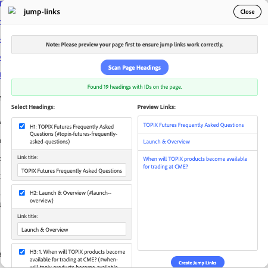

# Jump Links Plugin

A Document Authoring (DA) sidekick plugin for creating jump links to headings on your page. Perfect for building table of contents, FAQ navigation, and quick reference sections.

## 🎯 Overview

The Jump Links plugin scans your page for headings (H1-H6) that have been processed by Franklin and generates clickable anchor links. It's designed specifically for FAQ pages and content that needs internal navigation.



## ✨ Features

### 🔍 **Smart Heading Detection**
- Automatically scans Franklin-processed pages for headings with IDs
- Works with H1, H2, H3, H4, H5, and H6 elements
- Only shows headings that have Franklin-generated IDs (ensuring reliability)

### ☑️ **Multi-Select Interface**
- Checkbox-based selection for multiple headings
- Two-column layout optimized for 600x600 DA dialog
- Live preview of selected links on the right side

### 🎨 **Title Customization**
- Auto-populates link titles with heading text
- Individual title customization for each selected heading
- Real-time preview updates as you type

### 👀 **Live Preview**
- Interactive preview panel showing exactly how links will appear
- Clickable preview links for testing (opens in new tab)
- Instant updates when selections change

### 📤 **Clean HTML Output**
- Generates semantic HTML with proper paragraph tags
- Each link wrapped in `<p>` tags for clean line separation
- Includes `title` attributes for accessibility

## 🚀 How to Use

### Step 1: Preview Your Page
Before using the plugin, make sure your page has been previewed in Franklin to generate heading IDs.

### Step 2: Open the Plugin
1. Open Document Authoring
2. Navigate to your page
3. Open the sidekick and select "Jump Links"

### Step 3: Scan for Headings
1. Click the **"Scan Page Headings"** button
2. The plugin fetches your page and finds all headings with IDs
3. Results appear in the left column

### Step 4: Select & Customize
1. **Check the headings** you want to create links for
2. **Edit titles** in the text fields that appear (optional)
3. **Preview** your links in the right column

### Step 5: Create Links
1. Click **"Create Jump Links"** when satisfied
2. HTML is automatically inserted into your document
3. Plugin closes automatically

## 📋 Example Output

When you select headings and click "Create Jump Links", the plugin generates:

```html
<p><a href="https://main--aemsites--da-blog-tools.aem.page/your/page/path#launch--overview" title="Launch Guide">Launch Guide</a></p>
<p><a href="https://main--aemsites--da-blog-tools.aem.page/your/page/path#when-will-topix-products-become-available-for-trading-at-cme" title="TOPIX Availability">TOPIX Availability</a></p>
<p><a href="https://main--aemsites--da-blog-tools.aem.page/your/page/path#trading-hours" title="Trading Hours">Trading Hours</a></p>
```

## 🎯 Perfect For

### FAQ Pages
Create quick navigation to frequently asked questions:
- Select all question headings
- Generate table of contents at the top
- Users can jump directly to relevant answers

### Long Articles
Improve user experience with internal navigation:
- Section jumping in lengthy content
- Quick reference guides
- Technical documentation

### Educational Content
Enhance learning materials:
- Course module navigation
- Lesson jumping
- Reference sections

## 🛠️ Technical Details

### Requirements
- Page must be previewed in Franklin first
- Headings must have Franklin-generated IDs
- Works with Document Authoring environment

### Browser Support
- Modern browsers with ES6+ support
- Uses DA SDK for seamless integration
- Responsive design for various dialog sizes

### File Structure
```
tools/plugins/jump-links/
├── jump-links.html    # Plugin interface
├── jump-links.css     # Styling
├── jump-links.js      # Main functionality
└── README.md          # This documentation
```

## 🎨 Design Features

### DA Platform Native
- Uses Adobe Clean font family
- Consistent with DA design system
- Professional button styling and interactions

### 600x600 Dialog Optimized
- Compact layout for dialog constraints
- Scrollable sections where needed
- Responsive fallbacks for smaller screens

### User Experience
- Centered scan button for clear call-to-action
- Live feedback with status messages
- Intuitive two-column workflow

## 🔧 Error Handling

The plugin gracefully handles various scenarios:

- **No preview available**: Clear instructions to preview first
- **No headings found**: Informative error message
- **No headings with IDs**: Specific guidance about Franklin processing
- **Network issues**: Fallback error messaging

## 🚀 Future Enhancements

Potential improvements for future versions:
- Bulk title operations (e.g., "Title Case All")
- Custom link ordering/reordering
- Export options (plain text, markdown)
- Templates for common patterns

## 💡 Tips & Best Practices

1. **Always preview first** - Ensures Franklin has processed your headings
2. **Use descriptive titles** - Customize auto-generated titles for better UX
3. **Test your links** - Use the preview panel to verify functionality
4. **Organize logically** - Select headings in the order users would expect
5. **Keep titles concise** - Shorter titles work better in navigation

## 🐛 Troubleshooting

### "No headings with IDs found"
- Ensure your page has been previewed in Franklin
- Check that your headings are properly formatted (H1-H6)
- Verify headings have actual text content

### "Could not scan page"
- Make sure you have a preview available
- Check your internet connection
- Try refreshing and scanning again

### Links don't work
- Verify the base URL is correct
- Ensure heading IDs match between preview and live page
- Check that headings haven't been modified since preview

---

**Happy linking! 🔗** This plugin makes internal navigation setup quick and professional for any Franklin page.