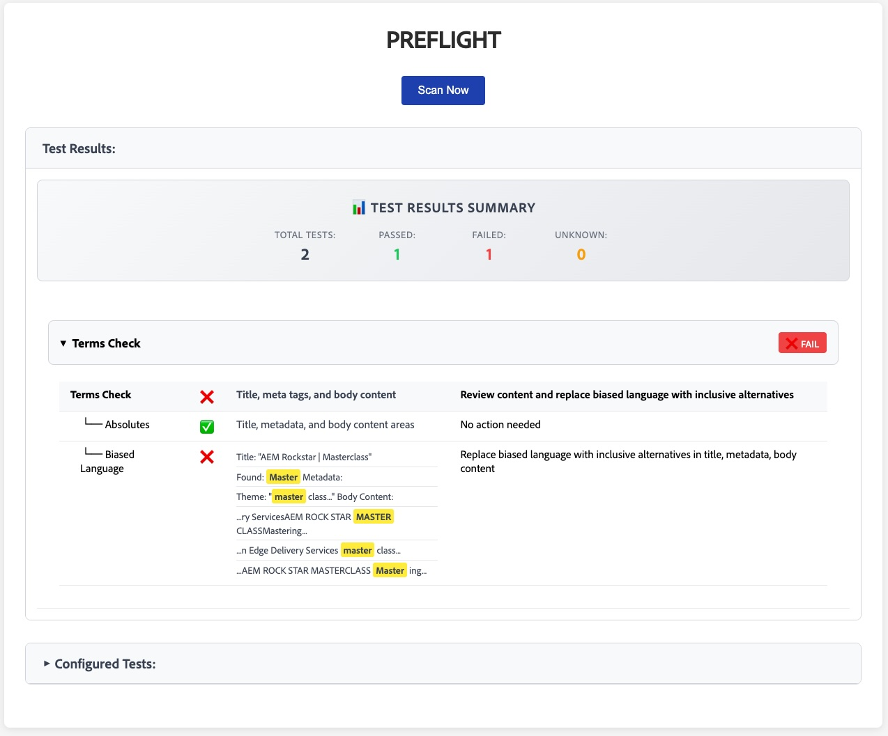

# Preflight Plugin

## Example UI


*Example: The Preflight plugin provides automated testing for AEM Sites pages, displaying test results with detailed pass/fail status and remediation guidance.*

## Overview

**Preflight** is a comprehensive testing plugin for AEM Sites that automatically validates page content against configurable quality standards. This plugin fetches page source content and runs a suite of tests to identify issues with spelling, metadata, templates, special characters, and more. It provides detailed reporting with actionable remediation steps to help content creators maintain high-quality standards.

## Purpose

- Automate quality assurance testing for AEM Sites pages
- Validate content against configurable standards and best practices  
- Provide detailed pass/fail results with specific issue locations
- Offer remediation guidance for identified problems
- Support extensible test framework for custom validation rules

## How It Works

- Fetches configuration from DA Config API (`/config/{org}/{repo}/`)
- Loads page source content from DA Source API 
- Executes configured test modules dynamically
- Displays results in an interactive table with collapsible test groups
- Provides summary statistics for overall page quality assessment

### Available Test Modules

- **Spelling Test** (`spellingTest.js`): Validates content against dictionary
- **Metadata Test** (`metadataTest.js`): Checks required metadata fields
- **Special Characters Test** (`special-charactersTest.js`): Identifies problematic characters
- **Absolutes Test** (`absolutesTest.js`): Checks for absolute URLs and references

## Usage

### Configuration

> Site _CONFIG_ > _preflight_

Configure which tests to run by adding test entries to your site configuration:

| key | value | label |
| --- | ----- | ----- |
| `test` | `spelling` | `Spelling Check` |
| `test` | `metadata` | `Metadata Validation` |
| `test` | `special-characters` | `Special Characters` |
| `test` | `absolutes` | `Absolute References` |

### Basic Usage

1. **Open Preflight Tool**: Navigate to the preflight plugin in your AEM Sites environment
2. **Review Configured Tests**: The tool displays all configured test modules from your site config
3. **Run Tests**: Click the "Scan Now" button to execute all configured tests on the current page
4. **Review Results**: Examine the detailed test results, including:
   - Overall summary with pass/fail counts
   - Individual test results with specific issue locations
   - Remediation guidance for failed tests
   - Expandable/collapsible test groups for better organization

### Test Results Interface

- **Summary Section**: Displays total tests run, passes, failures, and unknown results
- **Test Groups**: Each test module appears as a collapsible group
- **Status Indicators**: 
  - ✅ **Pass**: Test completed successfully
  - ❌ **Fail**: Issues found requiring attention
  - ❓ **Unknown**: Test could not be completed
- **Location Details**: Specific locations where issues were found (when applicable)
- **Remediation**: Actionable steps to fix identified problems

### Custom Test Development

To add custom tests:

1. **Use the template**: Copy `tests/templateTest.js` as a starting point (see `TEST_DEVELOPER.md` for detailed instructions)
2. Create a new test file in `/tests/` directory (e.g., `myCustomTest.js`)
3. Export a default function that accepts `pageSource` parameter
4. Return result object with required properties:
   ```javascript
   {
     status: 'pass|fail|unknown',
     location: 'Description of where issues were found',
     remediation: 'Steps to fix the issues',
     subTests: [] // Optional array of sub-test results
   }
   ```
5. Add the test to your site configuration with key `test` and value `myCustom`

> **Note**: The `templateTest.js` file is a developer template, not an actual test. It provides a comprehensive example and starting point for creating new tests.

## Test Module Details

### Spelling Test
- Validates content against a configurable dictionary
- Builds dictionary from various sources including site-specific terms
- Reports misspelled words with their locations in the content

### Metadata Test  
- Checks for required metadata fields
- Validates metadata format and structure
- Ensures proper SEO and content management metadata

### Special Characters Test
- Identifies problematic characters that may cause encoding issues
- Checks for invisible or non-standard Unicode characters
- Reports characters that may not render properly across all platforms

### Absolutes Test
- Scans for absolute language and terminology that may be inaccurate or unprofessional
- Identifies terms like "always", "never", "100%", "guaranteed", "perfect", "impossible"
- Helps maintain qualified, defensible content that avoids overstated claims

## Limitations

- Tests run against the current page source only
- Some tests may require additional configuration or dictionary files
- Test execution time varies based on page size and number of configured tests
- Network connectivity required for fetching page source and configuration

## Extension and Customization

- **Custom Dictionaries**: Add site-specific dictionaries for spelling tests
- **Test Parameters**: Configure test-specific parameters in site config
- **Custom Remediation**: Provide site-specific remediation guidance
- **Integration**: Extend tests to integrate with external validation services

---

**Maintainer:** Adobe Team Blackbird
